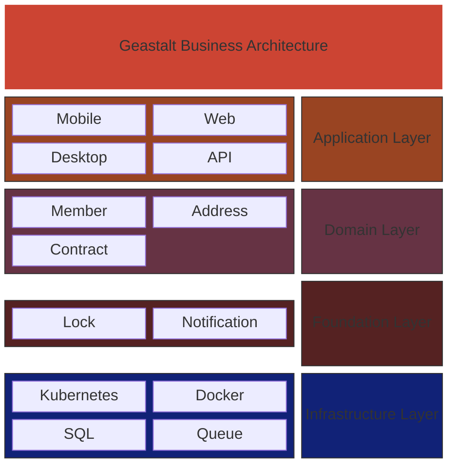

# Geastalt

Mono-repo for interconnected systems. Each system is an independent project with its own build, deployment, and Docker context.

## Systems

| System | Description | Status |
|--------|-------------|--------|
| [member](member/) | Member management service with gRPC/REST APIs and Kafka consumers | Active |
| [lock](lock/) | Distributed lock manager with Raft consensus and cross-region quorum | Active |

## Structure

```
geastalt/
├── member/           # Member management system
│   ├── member-api/
│   ├── member-common/
│   ├── member-consumer-ids/
│   ├── member-consumer-address/
│   ├── helm/
│   ├── k8s/
│   └── terraform/
├── lock/             # Distributed lock manager
│   ├── src/
│   ├── helm/
│   └── Dockerfile
└── (future systems)
```

## Design Principles

- **Independent builds**: Each system has its own parent POM and builds independently
- **Independent deployments**: Each system produces its own Docker images and Kubernetes resources
- **Shared nothing**: Systems communicate via APIs and messaging, not shared libraries
- **Docker context per system**: Each system's Dockerfile context is its own directory

## Architecture


