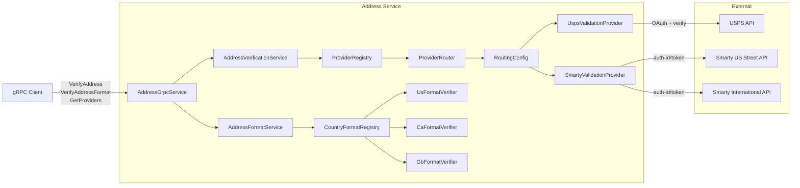

# Address Service

The address service supports validating and verifying addresses. The service makes a distinction between
_validating_, which checks the formatting of key address elements, and _verifification_, which checks against
a database of known good addresses and enhances the input data with additional data elements (such as longitude
and latitude values, zip+four elements, street types, etc.). Verification is an inherently costlier operation,
both monetarily and computationally, and is generally deferred to a third party.

## Overview

This service accepts postal addresses via gRPC, verifies them against external providers and/or validates address formatting for supported countries. The address service is stateless and idempotent.

The service provides two main services: _validation_ and _verification_. Validation tests to make sure that the address is formatted correctly, but does not check to see if the address actually improves or could be made more accurate. Validation is a pure native function and does not require an external provider.

For most use cases, this service will be used as part of address capture in two ways. Since the validation 
is a more lightweight process, it can be used during user input activities to highlight missing or mis-formatted elements. Depending on the user case, the verification service can also be called at time of data capture, to present the user with a "best alternative" address, or deferred to post processing.

Verification is a more complex and costly operation and is currently deferred to external partners. For those to be used, the address service has to be configured with the verification provide information as well as a strategy for selecting the right providers. Currently the address system supports <a href="https://developers.usps.com/addressesv3">USPS</a> (USA only) and <a href="https://www.smarty.com/">Smarty</a> as address providers (USA and international). It is the responsibility of the user to attain the necessary contract with these providers; see configuration below. Note that the Smarty provider populates longitude and latitude for the address on return, while the USPS does not.

The address service needs do know which service provider to use. This is done through a configuration on a country-by-country basis. This allows the use of different address verification services in different geographies. The configuration also allows for multiple verification services to be used, both for higher reliability and for cost management. The providers can be configured to distribute traffic via various routing strategies, as defined below.

### The configuration approach

Configuration is performed through the SpringBoot configuration mechanism, using application configurations. The specific configuration for the address providers is address.providers.routing-configuration. This property has a map of country code to routing strategy. An example configuration file in YAML format is below. Note that countries are given in ISO 3166-1 Numeric Country Code format, which is consistent with the overall address interface.

The caller can override the default configuration via the parameters to the call, or introspect the service
to see what providers are configured. See the API documentation for details.

```yaml
# Provider routing by country code
address:
  providers:
    routing-configuration:
      840:
        strategy: round_robin
        specification: usps,smarty
      124:
        provider: smarty
      826:
        provider: smarty
```

### Single provider configuration

The simplest configuration is for a single address provider per geography as demonstrated by the configurations for Canada (124) and Great Britian (820). For these configurations, the only thing that needs to be provided
is the name of the provider. Currently, providers can be "usps" or "smarty". 

### Multi-provider configuration

For many use cases, having a single provider is not sufficient for a number of reasons. The system might demand higher availability, necessitating a fall-back provider in case of an outage. The system might further benefit from limiting the calls to one provider for cost management. In order to this this, the address service also supports multi-provider configurations, along with a number of strategies on how to use the providers. Any number of providers can be specified, although there is currently a practical limit of two. However, the same provider can be specified multiple times.

The current strategies are 

| Strategy | Description |
|----------|-----------------------------------------------------------------|
| round_robin | Each provider is used in turn |
| failover | The providers are used in the order specified, unless an error is returned in which case the next one is tried. |
| counted | Each entry defines an absolute count of traffic to route to the provider |
| percentage| Each entry defines the percentage of traffic to route to the provider|


For the ```round_robin``` and ```failover``` strategies, the specification is just the list of providers to use. For failover, the first provider is always used unless it returns a failure, in which case the second is used, and then the third, and so forth. For the ```round_robin``` each request goes to a different provider in turn, so all providers are used.

For the ```counted``` and ```percentage``` strategies, the specification is a bit more complex. For these, each item in the specification names a provider and is followed by an integer (separated by a ":" character). For the ```counted```, the integer is the absolute number of requests to send to the provider during a time period before moving on to the next provider. For the ```percentage``` strategy, the integer represents a number (from 0 to 99) of the traffic to send to the provider. In both cases, the last item in the list should _not_ contain a number; this provider will infer the request count based on missing values. For ```counted``` all subsequent requests go to the last provider once the percentage of requests to the other providers have been satisfied. See the example below.


```yaml
# Provider routing by country code
address:
  providers:
    routing-configuration:
      840:
        strategy: percentage
        specification: usps:20,smarty
      124:
        provider: smarty
      826:
        provider: smarty
```

**Note**
The implementation of the ```percentage``` strategy implements the percentage for each 100 request block. In other words, for the above specification the first 20 requests out of each 100 go to USPS, and the remaining 80 go to Smarty.


## Credentials

The address service requires credentials for each verification provider you intend to use. Providers with missing or empty credentials are automatically disabled — the service will start but routing to that provider will fail at runtime.

### USPS

USPS uses OAuth2 client credentials. Register for API access at the [USPS Developer Portal](https://developers.usps.com/) to obtain a client ID and secret.

| Variable | Description | Default |
|----------|-------------|---------|
| `USPS_CLIENT_ID` | OAuth2 client ID | _(empty — provider disabled)_ |
| `USPS_CLIENT_SECRET` | OAuth2 client secret | _(empty — provider disabled)_ |
| `USPS_BASE_URL` | API base URL | `https://apis-tem.usps.com` |

### Smarty

Smarty uses auth-id/auth-token query parameters. Register at [Smarty](https://www.smarty.com/) to obtain credentials. A single set of credentials covers both the US Street and International Street APIs.

| Variable | Description | Default |
|----------|-------------|---------|
| `SMARTY_AUTH_ID` | Smarty auth ID | _(empty — provider disabled)_ |
| `SMARTY_AUTH_TOKEN` | Smarty auth token | _(empty — provider disabled)_ |
| `SMARTY_US_STREET_BASE_URL` | US Street API base URL | `https://us-street.api.smarty.com` |
| `SMARTY_INTERNATIONAL_BASE_URL` | International Street API base URL | `https://international-street.api.smarty.com` |

### Local development

For local development, set the environment variables directly:

```bash
export USPS_CLIENT_ID=your-client-id
export USPS_CLIENT_SECRET=your-client-secret
export SMARTY_AUTH_ID=your-auth-id
export SMARTY_AUTH_TOKEN=your-auth-token
```

### Kubernetes Secret

The Helm chart expects a Kubernetes secret named `address-secret` (configurable via `secretName` in `values.yaml`). The deployment mounts all four credential keys from this secret as environment variables.

Create the secret before deploying:

```bash
kubectl create secret generic address-secret \
  --namespace address \
  --from-literal=USPS_CLIENT_ID=your-client-id \
  --from-literal=USPS_CLIENT_SECRET=your-client-secret \
  --from-literal=SMARTY_AUTH_ID=your-auth-id \
  --from-literal=SMARTY_AUTH_TOKEN=your-auth-token
```

For production, consider using an external secrets manager instead of manually-created secrets:

| Approach | Description |
|----------|-------------|
| [External Secrets Operator](https://external-secrets.io/) | Syncs secrets from AWS Secrets Manager, GCP Secret Manager, Azure Key Vault, HashiCorp Vault, and others into Kubernetes secrets. Recommended for most cloud deployments. |
| [Sealed Secrets](https://github.com/bitnami-labs/sealed-secrets) | Encrypts secrets so they can be safely stored in Git. Good for GitOps workflows where all configuration is version-controlled. |
| [HashiCorp Vault](https://www.vaultproject.io/) + [Vault Secrets Operator](https://developer.hashicorp.com/vault/docs/platform/k8s/vso) | Full-featured secrets management with rotation, dynamic credentials, and audit logging. Best for organizations already running Vault. |

All three approaches ultimately produce a standard Kubernetes secret that the Helm chart consumes — no changes to the deployment template are needed.


## Ports

| Protocol | Port | Description |
|----------|------|-------------|
| gRPC | 9010 | Address verification API |
| HTTP | 9011 | Health/management endpoints |

## Architecture



## API Reference

The address service exposes three gRPC RPCs on port 9010 via `com.gaestalt.address.grpc.AddressService`. All RPCs use the shared `PostalAddress` message type described below.

### PostalAddress

International postal address model used in all requests and responses.

| Field | Type | Required | Description |
|-------|------|----------|-------------|
| `country_code` | `int32` | Yes | ISO 3166-1 numeric country code (840=US, 124=CA, 826=GB) |
| `address_lines` | `repeated string` | Yes | Street address lines (line 1, secondary address, etc.) |
| `locality` | `string` | Yes | City, town, or village |
| `administrative_area` | `string` | Yes | State, province, or region |
| `postal_code` | `string` | Yes | ZIP or postal code |
| `sub_locality` | `optional string` | No | Neighborhood, borough, or district |
| `organization` | `optional string` | No | Organization or company name |
| `recipient` | `optional string` | No | Recipient name |

---

### VerifyAddress

Verifies an address against an external provider (USPS, Smarty) and returns a standardized result. The service routes to the appropriate provider based on country code and the configured routing strategy, or the caller can override with a specific provider.

```protobuf
rpc VerifyAddress(VerifyAddressRequest) returns (VerifyAddressResponse);
```

#### Request

| Field | Type | Required | Description |
|-------|------|----------|-------------|
| `address` | `PostalAddress` | Yes | Address to verify |
| `provider_id` | `optional string` | No | Force a specific provider (e.g. `"usps"`, `"smarty"`). If omitted, the routing strategy selects the provider. |

#### Response

| Field | Type | Description |
|-------|------|-------------|
| `status` | `VerificationStatus` | Verification outcome (see below) |
| `standardized_address` | `PostalAddress` | Standardized/corrected address returned by the provider |
| `provider_id` | `string` | ID of the provider that performed verification |
| `metadata` | `map<string, string>` | Provider-specific metadata (see below) |
| `message` | `string` | Human-readable message (e.g. error details) |
| `latitude` | `optional double` | Latitude of the address, if the provider supports geocoding |
| `longitude` | `optional double` | Longitude of the address, if the provider supports geocoding |

#### VerificationStatus

| Status | Description |
|--------|-------------|
| `VERIFIED` | Address is valid and matches the input exactly |
| `VERIFIED_WITH_CORRECTIONS` | Address is valid but was corrected (e.g. ZIP+4 added, casing normalized) |
| `INVALID` | Provider could not verify the address |
| `PROVIDER_UNAVAILABLE` | No provider is configured or available for the given country |
| `PROVIDER_ERROR` | Provider returned an error (network failure, auth issue, etc.) |

#### Geocoordinates

The `latitude` and `longitude` fields are optional and depend on provider support:

| Provider | Geocoding | Notes |
|----------|-----------|-------|
| Smarty | Yes | Populated for both US and international addresses |
| USPS | No | Fields will be absent |

#### Provider metadata

Each provider may return additional metadata in the `metadata` map:

**Smarty (US Street)**

| Key | Description |
|-----|-------------|
| `countyName` | County name |
| `recordType` | Record type (S=street, P=PO Box, etc.) |
| `rdi` | Residential Delivery Indicator (`Residential` or `Commercial`) |
| `dpvMatchCode` | Delivery Point Validation match code |
| `dpvFootnotes` | DPV footnote codes |
| `active` | Whether the address is active (`Y`/`N`) |

**USPS**

| Key | Description |
|-----|-------------|
| `deliveryPoint` | Delivery point code |
| `carrierRoute` | Carrier route code |
| `dpvConfirmation` | DPV confirmation indicator |
| `dpvCmra` | Commercial Mail Receiving Agency indicator |
| `business` | Business address indicator |
| `vacant` | Vacant address indicator |

#### Example: Verify a US address (Smarty provider)

Request:

```bash
grpcurl -plaintext -d '{
  "address": {
    "country_code": 840,
    "address_lines": ["1600 Pennsylvania Ave NW"],
    "locality": "Washington",
    "administrative_area": "DC",
    "postal_code": "20500"
  }
}' localhost:9010 com.gaestalt.address.grpc.AddressService/VerifyAddress
```

Response:

```json
{
  "status": "VERIFIED_WITH_CORRECTIONS",
  "standardizedAddress": {
    "countryCode": 840,
    "addressLines": ["1600 Pennsylvania Ave NW"],
    "locality": "Washington",
    "administrativeArea": "DC",
    "postalCode": "20500-0005"
  },
  "providerId": "smarty",
  "metadata": {
    "countyName": "District of Columbia",
    "recordType": "S",
    "rdi": "Commercial",
    "dpvMatchCode": "Y",
    "dpvFootnotes": "AABB",
    "active": "Y"
  },
  "latitude": 38.8977,
  "longitude": -77.0365
}
```

#### Example: Verify with provider override

```bash
grpcurl -plaintext -d '{
  "address": {
    "country_code": 840,
    "address_lines": ["123 Main St"],
    "locality": "Springfield",
    "administrative_area": "IL",
    "postal_code": "62704"
  },
  "provider_id": "usps"
}' localhost:9010 com.gaestalt.address.grpc.AddressService/VerifyAddress
```

Note: When using `provider_id` to force USPS, `latitude` and `longitude` will not be present in the response.

#### Example: Verify a Canadian address

```bash
grpcurl -plaintext -d '{
  "address": {
    "country_code": 124,
    "address_lines": ["80 Wellington St"],
    "locality": "Ottawa",
    "administrative_area": "ON",
    "postal_code": "K1A 0A2"
  }
}' localhost:9010 com.gaestalt.address.grpc.AddressService/VerifyAddress
```

---

### VerifyAddressFormat

Validates that an address is formatted correctly for its country without calling an external provider. Checks required fields, postal code patterns, and valid administrative area codes. This is a pure local operation suitable for real-time UI validation during data entry.

```protobuf
rpc VerifyAddressFormat(VerifyAddressFormatRequest) returns (VerifyAddressFormatResponse);
```

Supported countries: US (840), CA (124), GB (826). Unsupported countries return `FORMAT_UNSUPPORTED_COUNTRY`.

#### Request

| Field | Type | Required | Description |
|-------|------|----------|-------------|
| `address` | `PostalAddress` | Yes | Address to validate |

#### Response

| Field | Type | Description |
|-------|------|-------------|
| `status` | `FormatStatus` | Format validation outcome |
| `corrected_address` | `PostalAddress` | Address with corrections applied (e.g. case normalization) |
| `issues` | `repeated FormatIssue` | Individual field-level issues found |

#### FormatStatus

| Status | Description |
|--------|-------------|
| `FORMAT_VALID` | All fields are present and correctly formatted |
| `FORMAT_CORRECTED` | Valid but minor corrections were applied (e.g. `"il"` → `"IL"`) |
| `FORMAT_INVALID` | One or more fields are missing or invalid |
| `FORMAT_UNSUPPORTED_COUNTRY` | No format verifier is available for the given country code |

#### FormatIssue

Each issue describes a problem or correction on a single field.

| Field | Type | Description |
|-------|------|-------------|
| `field` | `string` | Field name (e.g. `"postal_code"`, `"administrative_area"`, `"address_lines"`) |
| `severity` | `FormatIssueSeverity` | `ERROR` (invalid), `WARNING`, or `INFO` (auto-corrected) |
| `code` | `FormatIssueCode` | Machine-readable code: `FIELD_REQUIRED`, `FIELD_INVALID`, or `FIELD_CORRECTED` |
| `original_value` | `string` | The value as submitted |
| `corrected_value` | `string` | The corrected value (empty if severity is `ERROR`) |

#### Example: Valid US address

```bash
grpcurl -plaintext -d '{
  "address": {
    "country_code": 840,
    "address_lines": ["123 Main St"],
    "locality": "Springfield",
    "administrative_area": "IL",
    "postal_code": "62704"
  }
}' localhost:9010 com.gaestalt.address.grpc.AddressService/VerifyAddressFormat
```

Response:

```json
{
  "status": "FORMAT_VALID",
  "correctedAddress": {
    "countryCode": 840,
    "addressLines": ["123 Main St"],
    "locality": "Springfield",
    "administrativeArea": "IL",
    "postalCode": "62704"
  }
}
```

#### Example: Address with corrections

```bash
grpcurl -plaintext -d '{
  "address": {
    "country_code": 840,
    "address_lines": ["123 Main St"],
    "locality": "Springfield",
    "administrative_area": "il",
    "postal_code": "62704"
  }
}' localhost:9010 com.gaestalt.address.grpc.AddressService/VerifyAddressFormat
```

Response:

```json
{
  "status": "FORMAT_CORRECTED",
  "correctedAddress": {
    "countryCode": 840,
    "addressLines": ["123 Main St"],
    "locality": "Springfield",
    "administrativeArea": "IL",
    "postalCode": "62704"
  },
  "issues": [
    {
      "field": "administrative_area",
      "severity": "INFO",
      "code": "FIELD_CORRECTED",
      "originalValue": "il",
      "correctedValue": "IL"
    }
  ]
}
```

#### Example: Invalid address (missing required fields)

```bash
grpcurl -plaintext -d '{
  "address": {
    "country_code": 840,
    "address_lines": ["123 Main St"],
    "locality": "Springfield",
    "administrative_area": "IL",
    "postal_code": "ABCDE"
  }
}' localhost:9010 com.gaestalt.address.grpc.AddressService/VerifyAddressFormat
```

Response:

```json
{
  "status": "FORMAT_INVALID",
  "correctedAddress": {
    "countryCode": 840,
    "addressLines": ["123 Main St"],
    "locality": "Springfield",
    "administrativeArea": "IL",
    "postalCode": "ABCDE"
  },
  "issues": [
    {
      "field": "postal_code",
      "severity": "ERROR",
      "code": "FIELD_INVALID",
      "originalValue": "ABCDE",
      "correctedValue": ""
    }
  ]
}
```

#### Example: Canadian postal code validation

```bash
grpcurl -plaintext -d '{
  "address": {
    "country_code": 124,
    "address_lines": ["80 Wellington St"],
    "locality": "Ottawa",
    "administrative_area": "ON",
    "postal_code": "K1A 0A2"
  }
}' localhost:9010 com.gaestalt.address.grpc.AddressService/VerifyAddressFormat
```

---

### GetProviders

Lists all registered verification providers, their supported countries, and whether they are currently enabled (have valid credentials configured).

```protobuf
rpc GetProviders(GetProvidersRequest) returns (GetProvidersResponse);
```

#### Request

Empty message — no parameters.

#### Response

| Field | Type | Description |
|-------|------|-------------|
| `providers` | `repeated ProviderInfo` | List of registered providers |

#### ProviderInfo

| Field | Type | Description |
|-------|------|-------------|
| `provider_id` | `string` | Unique provider ID (e.g. `"usps"`, `"smarty"`) |
| `display_name` | `string` | Human-readable provider name |
| `supported_countries` | `repeated int32` | ISO 3166-1 numeric country codes this provider supports |
| `enabled` | `bool` | `true` if credentials are configured and the provider is active |

#### Example

```bash
grpcurl -plaintext -d '{}' localhost:9010 com.gaestalt.address.grpc.AddressService/GetProviders
```

Response:

```json
{
  "providers": [
    {
      "providerId": "usps",
      "displayName": "USPS Address Verification API",
      "supportedCountries": [840],
      "enabled": true
    },
    {
      "providerId": "smarty",
      "displayName": "Smarty Address Verification API",
      "supportedCountries": [840, 124, 826],
      "enabled": true
    }
  ]
}
```

## Provider Architecture

Verification providers implement the `VerificationProvider` interface and are auto-discovered by Spring:

```
provider/
├── VerificationProvider.java         # Provider interface
├── VerificationRequest.java          # Internal request model
├── VerificationResult.java           # Internal result model
├── ProviderRegistry.java             # Routes by country code
├── routing/
│   ├── ProviderRouter.java           # Selects providers via strategy
│   ├── RoutingConfig.java            # Parses routing configuration
│   ├── ProviderLoadBalancerStrategy.java  # Sealed strategy interface
│   ├── TrivialLoadBalancerStrategy.java   # Single provider
│   ├── FailoverLoadBalancerStrategy.java  # Fixed priority order
│   ├── RoundRobinLoadBalancerStrategy.java
│   ├── CountBasedLoadBalancerStrategy.java
│   └── PercentBasedLoadBalancerStrategy.java
├── usps/
│   ├── UspsValidationProvider.java   # USPS API integration
│   ├── UspsOAuthService.java         # OAuth2 token management
│   ├── UspsConfig.java               # USPS configuration
│   └── Usps*Request/Response.java    # USPS DTOs
└── smarty/
    ├── SmartyValidationProvider.java # Smarty API integration (US + international)
    ├── SmartyConfig.java             # Smarty configuration
    └── Smarty*Response.java          # Smarty DTOs
```

## Format Verification

Format verifiers validate address formatting without calling external APIs:

| Country | Postal Code | Admin Area | Notes |
|---------|-------------|------------|-------|
| US | `12345` or `12345-6789` | 50 states + DC + territories | All fields required |
| CA | `K1A 0B1` | 13 provinces/territories | All fields required |
| GB | Various UK patterns | Not required | Postcode + locality required |


## Building

```bash
# From address/ directory
cd address
mvn clean package -DskipTests

# Build Docker image
docker build -t address:latest .
```

## Testing

```bash
# Run unit tests
mvn test

# List available gRPC services
grpcurl -plaintext localhost:9010 list

# Describe service methods
grpcurl -plaintext localhost:9010 describe com.gaestalt.address.grpc.AddressService
```

See the [API Reference](#api-reference) above for `grpcurl` examples for each RPC.

## Health Endpoints

| Endpoint | Description |
|----------|-------------|
| `/actuator/health` | Overall health status |
| `/actuator/health/liveness` | Kubernetes liveness probe |
| `/actuator/health/readiness` | Kubernetes readiness probe |
